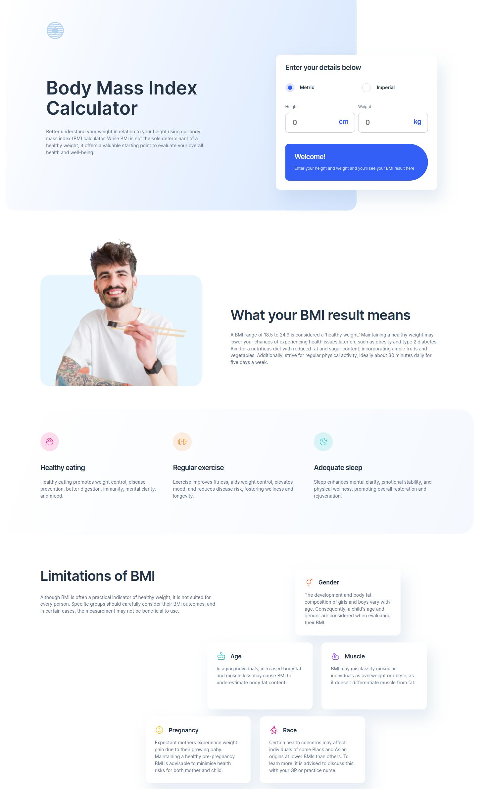

# Body Mass Index Calculator - Frontend Mentor
This solution addresses the [Body Mass Index Calculator challenge from Frontend Mentor]([https://www.frontendmentor.io/challenges](https://www.frontendmentor.io/challenges/body-mass-index-calculator-brrBkfSz1T)).

## The Challenge
- Choose between metric or imperial units.
- Input their height and weight.
- View their BMI result along with weight classification and healthy weight range.
- Experience an optimal interface layout based on their device's screen size.
- Observe hover and focus states for all interactive elements on the page.

## Screenshot

## Links
- Solution URL: https://www.frontendmentor.io/solutions/responsive-bmi-reactjs-sass-grid-flexbox-TLkD2NWbKI
- Live Site URL: https://bmi-calculator-fadi.vercel.app/

## Built With

- ReactJS
- JavaScript
- SCSS
- Flexbox and Grid layouts
- Media Query
